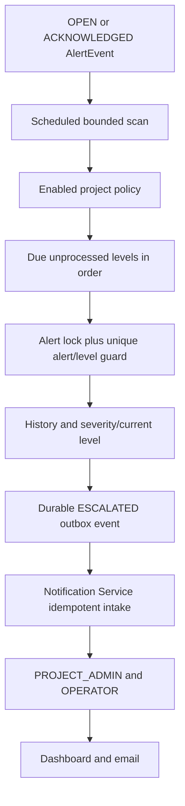

# SCRUM-712 Alert Escalation Policy Engine

Alert Service owns project-scoped escalation policies, ordered levels, current escalation state, scheduled evaluation, and immutable history. Notification Service delivers durable `ESCALATED` lifecycle events. An episode starts at `AlertEvent.triggeredAt`; acknowledgement changes its reason from `UNACKNOWLEDGED` to `UNRESOLVED` without resetting elapsed time. Resolution makes it ineligible, while reopening creates a new AlertEvent episode.

Levels have unique positive numbers and strictly increasing elapsed thresholds. If scheduling was interrupted, all due levels are processed in order in one transaction. Severity is the higher of current and target severity. Disabled policies/levels and resolved alerts are skipped. Interval and batch size are configurable; persisted state survives restart.

Evaluation locks each AlertEvent and checks history, while database uniqueness on `(alert_event_id, level_number)` provides the final duplicate guard. History records policy, level, previous/resulting severity, reason, and time. The model uses `escalation_policies`, `escalation_policy_levels`, `alert_escalation_history`, current AlertEvent fields, and escalation metadata in the existing Alert outbox.

JWT and project access are required. PROJECT_ADMIN and platform ADMIN may modify policy; OPERATOR and VIEWER cannot. Project members may read policy/history. Internal Notification intake remains protected by the internal-service key and is not publicly routed.

PagerDuty, Slack, Teams, SMS, Telegram, external incident platforms, and automatic remediation remain out of scope.
