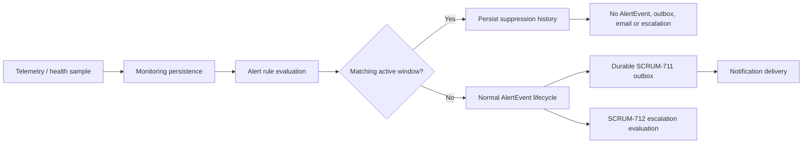

# SCRUM-713 Alert Suppression and Maintenance

Alert Service owns project-scoped maintenance windows and immutable suppression evidence. Maintenance is checked after rule evaluation and before an eligible triggered condition creates an `AlertEvent` or durable notification outbox entry. Monitoring Service continues to ingest and persist telemetry and health evidence; Device Service continues heartbeat processing.

Time is authoritative: a window is active when `enabled AND startsAt <= evaluatedAt < endsAt`. No scheduler state flip is required, so expiry is automatic and restart-safe. PROJECT matches all eligible sources in its project; SERVICE and DEVICE match only their validated project-owned source. Active lookup is project- and time-scoped and indexed.

`maintenance_windows` stores configuration, `alert_suppression_history` stores the evaluated rule/source/value/threshold/window snapshot, and `maintenance_window_audit` records create, update and disable operations with the caller. Application duplicate checks and the unique `(maintenance_window_id, dedup_key)` constraint protect one logical evaluation/window combination. Overlapping windows deliberately retain one evidence row per matching window.

JWT authentication and Project Service workspace authorization are reused. Project members may read. Only platform ADMIN or PROJECT_ADMIN may create, update, or disable; service/device association is validated against the project workspace. Internal evaluation endpoints remain unavailable through Gateway routes.

Deleting uses a disable operation rather than physical deletion so suppression and audit evidence remains intact. Recurrence, calendar/CI integration, PagerDuty, SMS, remediation and cross-project suppression are out of scope.
