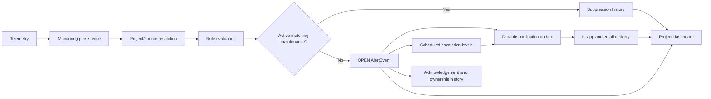

# Sprint 8 Intelligent Alerting Platform

Sprint 8 composes the existing monitoring, alert, project, notification, gateway and dashboard capabilities into one project-isolated lifecycle. Monitoring always persists evidence first. Alert Service evaluates project rules and either records a maintenance suppression or creates the durable alert lifecycle. Notification delivery and escalation operate only on generated AlertEvents.

The public V2 Alert, escalation, maintenance and Notification APIs retain their full paths through API Gateway and require JWT authentication. Project Service supplies workspace role, membership and source ownership. Project queries and persisted records always include `projectId`; internal Alert evaluation is authenticated and is not exposed as a Gateway route.

The Docker Monitoring Service must use `EDGE_CLOUD_PROJECT_URL=http://project-service:8086` and `EDGE_CLOUD_ALERT_URL=http://alert-service:8084`. This preserves the sequence `persist -> resolve -> evaluate` inside the Compose network. Maintenance never disables telemetry, heartbeat or health persistence.

Alert Flyway versions 2–7 cover rules, lifecycle, ownership, durable outbox, escalation, maintenance, audit and suppression. Notification Flyway versions 1–5 cover source-event idempotency, user notifications, delivery state and escalation metadata. Time-based expiry, source-event uniqueness, active-alert uniqueness, suppression deduplication and alert/level uniqueness remain database-backed restart-safe guards.
