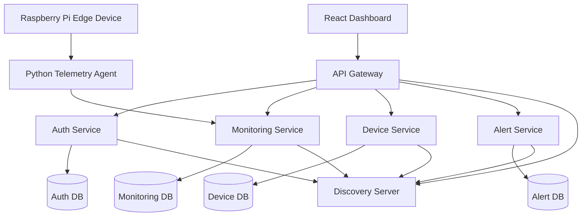

# EdgeCloud Monitor
## Deployment and Infrastructure Plan

---

# 1. Introduction

This document defines the deployment strategy and infrastructure design for EdgeCloud Monitor.

The platform is designed as a cloud-native distributed system using containerised microservices and isolated infrastructure components.

The deployment plan aims to support:

- modular deployment
- service scalability
- infrastructure isolation
- distributed communication
- cloud-native engineering practices
- reproducible environments

---

# 2. Deployment Goals

The infrastructure design aims to:

- support distributed microservices
- simplify deployment and testing
- isolate services and databases
- support local development
- support future cloud deployment
- support edge device integration
- demonstrate DevOps and containerisation concepts

---

# 3. Infrastructure Overview

The infrastructure will include:

- API Gateway
- Discovery Server
- Authentication Service
- Monitoring Service
- Device Service
- Alert Service
- React Dashboard
- MySQL Databases
- Docker Networking
- Raspberry Pi Edge Agent

All backend services will run inside Docker containers.

---

# 4. Planned Infrastructure Architecture



---

# 5. Containerisation Strategy

The platform will use Docker for service containerisation.

Each component will run in an isolated container.

---

# Planned Containers

| Container | Purpose |
|---|---|
| edgecloud-gateway | API Gateway |
| edgecloud-discovery | Eureka Discovery Server |
| edgecloud-auth-service | Authentication |
| edgecloud-monitoring-service | Monitoring |
| edgecloud-device-service | Device Management |
| edgecloud-alert-service | Alert Handling |
| edgecloud-dashboard | React Frontend |
| auth-mysql | Auth Database |
| monitoring-mysql | Monitoring Database |
| device-mysql | Device Database |
| alert-mysql | Alert Database |

---

# 6. Docker Compose Strategy

Docker Compose will orchestrate the local infrastructure.

Docker Compose responsibilities:

- service startup
- container networking
- environment variables
- dependency management
- database provisioning

---

# 7. Docker Health Check Strategy

Containers will use health checks to verify service availability and startup readiness.

Example checks include:

- Spring Boot actuator health endpoints
- MySQL availability checks
- API Gateway readiness
- Eureka registration validation

Example:

```yaml
healthcheck:
  test: ["CMD", "curl", "-f", "http://localhost:8081/actuator/health"]
  interval: 30s
  timeout: 10s
  retries: 5
```

Health checks improve:

- deployment stability
- startup sequencing
- monitoring reliability
- container orchestration readiness

---

# 8. Planned Docker Network Design

A dedicated internal Docker network will be used.

Example:

```text
edgecloud-network
```

Benefits include:

- service discovery
- internal communication
- container isolation
- simplified networking

---

# 9. Environment Configuration Strategy

Each service will maintain isolated configuration.

Planned configuration areas:

- database credentials
- JWT secrets
- service ports
- gateway routes
- Eureka registration
- telemetry configuration

Environment variables will be used where possible.

---

# 10. Environment Isolation Strategy

The platform will support separate environments for:

- local development
- Docker integration testing
- future cloud deployment

Configuration will be isolated using:

- environment variables
- Docker Compose overrides
- service-specific configuration files

Sensitive configuration such as JWT secrets and database credentials will not be hardcoded.

---

# 11. Planned Service Ports

| Service | Planned Port |
|---|---|
| API Gateway | 8080 |
| Discovery Service | 8761 |
| Auth Service | 8081 |
| Monitoring Service | 8082 |
| Device Service | 8083 |
| Alert Service | 8084 |
| React Dashboard | 3000 |

---

# 12. Database Deployment Strategy

Each service will own its own database container.

Benefits:

- service isolation
- independent scaling
- improved maintainability
- reduced coupling

The databases will initially use MySQL containers.

---

# 13. Persistent Storage Strategy

MySQL containers will use Docker volumes for persistent storage.

Benefits include:

- database persistence across container restarts
- safer local development
- easier backup management
- improved deployment stability

---

# 14. React Frontend Deployment

The React dashboard will communicate exclusively through the API Gateway.

The frontend will:

- consume REST APIs
- visualise monitoring data
- display alerts
- display telemetry metrics

The dashboard will later be containerised using Docker.

---

# 15. Edge Device Deployment Strategy

The Raspberry Pi telemetry agent will operate externally from the Docker infrastructure.

Responsibilities include:

- telemetry collection
- heartbeat transmission
- metric reporting
- REST communication

The edge agent will communicate directly with backend APIs.

---

# 16. Infrastructure Startup Order

Recommended startup sequence:

1. Discovery Service
2. Databases
3. API Gateway
4. Auth Service
5. Monitoring Service
6. Device Service
7. Alert Service
8. React Dashboard
9. Edge Agent

---

# 17. Logging Strategy

Initial logging approach:

- Spring Boot application logs
- Docker container logs
- structured service logging

Future optional extensions:

- ELK Stack
- centralised logging
- distributed tracing

---

# 18. Observability Infrastructure

The platform will expose monitoring information through:

- Spring Boot Actuator endpoints
- structured application logs
- Docker container logs
- telemetry metrics
- heartbeat monitoring

Future observability extensions may include:

- Prometheus metrics
- Grafana dashboards
- distributed tracing
- ELK Stack integration

---

# 19. Monitoring Strategy

The infrastructure itself will also be monitored.

Areas include:

- service health
- database connectivity
- response latency
- container status
- edge telemetry
- heartbeat availability

---

# 20. Security Strategy

Security measures include:

- JWT authentication
- secured gateway routes
- isolated service databases
- environment-based secrets
- internal container networking

---

# 21. Scalability Considerations

The architecture supports future scalability through:

- container isolation
- stateless services
- independent deployment
- discovery-based communication

Potential future scalability extensions include:

- Kubernetes orchestration
- cloud deployment
- load balancing
- horizontal scaling

---

# 22. Cloud Deployment Possibilities

Potential future deployment targets:

- Render
- Railway
- AWS
- Azure

Initial development will remain local-first using Docker Compose.

---

# 23. CI/CD Possibilities

Future CI/CD integration may include:

- GitHub Actions
- Jenkins
- automated Docker builds
- automated deployment
- automated testing pipelines

These features are considered optional future enhancements.

---

# 24. Risk Considerations

Potential deployment risks include:

- container networking issues
- database startup failures
- service registration problems
- gateway routing failures
- environment misconfiguration

Mitigation strategies:

- incremental deployment
- isolated testing
- container health checks
- structured documentation

---

# 25. Engineering Benefits

The deployment strategy demonstrates:

- cloud-native engineering
- DevOps concepts
- distributed deployment
- container orchestration
- infrastructure planning
- scalable backend engineering

---

# 26. Deployment Evidence Collection

Deployment evidence will be collected continuously throughout development.

Evidence includes:

- Docker Compose screenshots
- running container logs
- Eureka registration screenshots
- API Gateway routing verification
- React dashboard screenshots
- edge telemetry demonstrations
- database connectivity validation
- health endpoint verification

This evidence will support:

- weekly logs
- interim presentation
- interim report
- final report
- final demonstration

---

# 27. Conclusion

The proposed deployment and infrastructure strategy provides a scalable and modular foundation for EdgeCloud Monitor.

The infrastructure combines:

- Docker containerisation
- distributed services
- cloud-native deployment
- service isolation
- edge device integration

while maintaining professional software engineering and infrastructure practices.