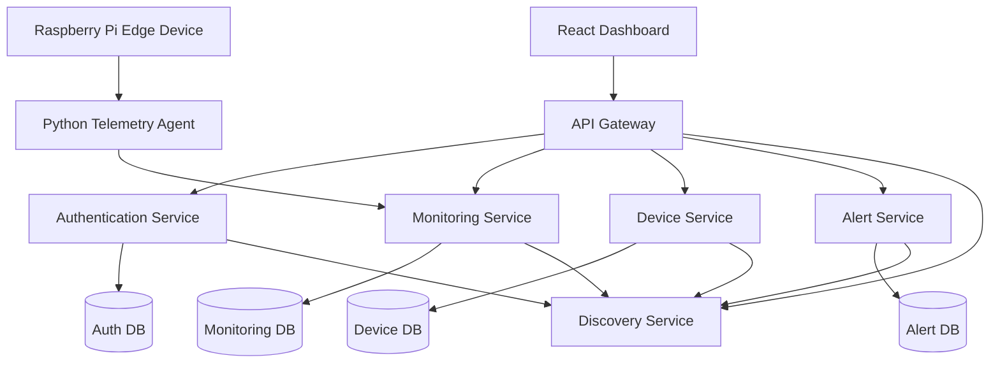

# EdgeCloud Monitor
## System Architecture Design

---

# 1. Introduction

This document defines the proposed system architecture for EdgeCloud Monitor.

The architecture follows a cloud-native microservices approach designed to support:

- distributed monitoring
- service observability
- edge device telemetry
- cloud-native deployment
- scalable backend infrastructure

The system is intended to monitor both backend microservices and edge computing devices through a unified monitoring platform.

---

# 2. Architectural Goals

The system architecture aims to achieve the following goals:

- modular service separation
- scalability
- maintainability
- service isolation
- independent deployment
- distributed monitoring
- secure communication
- observability
- edge integration

The architecture is intentionally designed to simulate modern industry cloud-native environments.

---

# 3. High-Level Architecture

The platform will consist of:

- React Dashboard Frontend
- API Gateway
- Service Discovery Server
- Authentication Service
- Monitoring Service
- Device Service
- Alert Service
- Edge Telemetry Agent
- Auth Database
- Monitoring Database
- Device Database
- Alert Database

The architecture follows:

Frontend → Gateway → Microservices

communication flow.

---

# 4. High-Level System Flow

## User Flow

1. User accesses React dashboard
2. Dashboard communicates with API Gateway
3. Gateway routes requests to services
4. JWT authentication secures APIs
5. Services return monitoring data
6. Dashboard visualises system health

---

## Edge Telemetry Flow

1. Raspberry Pi agent collects telemetry
2. Telemetry sent to backend through REST APIs
3. Monitoring Service processes telemetry
4. Alert Service evaluates failures
5. Dashboard visualises device health

---

# 5. Proposed System Architecture Diagram



---

# 6. Core Architectural Components

---

## 6.1 API Gateway

### Purpose

The API Gateway acts as the single entry point for all frontend requests.

### Responsibilities

- request routing
- API forwarding
- security enforcement
- JWT validation
- centralised communication management

### Planned Technology

- Spring Cloud Gateway

### Example Routes

```text
/api/v1/auth/**
/api/v1/monitoring/**
/api/v1/devices/**
/api/v1/alerts/**
```

---

## 6.2 Discovery Service

### Purpose

The Discovery Service enables dynamic service registration and discovery.

### Responsibilities

- service registration
- service lookup
- service availability tracking

### Planned Technology

- Netflix Eureka Server

### Benefits

- dynamic scaling support
- reduced hardcoded configuration
- easier distributed deployment

---

## 6.3 Authentication Service

### Purpose

Provides authentication and security functionality.

### Responsibilities

- user login
- JWT generation
- JWT validation
- user management
- role management

### Planned Technology

- Spring Boot
- Spring Security
- JWT

### Database Ownership

Own dedicated MySQL database.

---

## 6.4 Monitoring Service

### Purpose

Core monitoring engine of the platform.

### Responsibilities

- service health monitoring
- API response monitoring
- telemetry processing
- metrics storage
- uptime tracking
- latency tracking

### Planned Monitoring Areas

- microservices
- APIs
- Docker containers
- system metrics

### Database Ownership

Own dedicated MySQL database.

---

## 6.5 Device Service

### Purpose

Handles edge device management and telemetry registration.

### Responsibilities

- edge device registration
- device status management
- heartbeat tracking
- telemetry association

### Planned Devices

- Raspberry Pi edge nodes

### Database Ownership

Own dedicated MySQL database.

---

## 6.6 Alert Service

### Purpose

Handles fault detection and alert generation.

### Responsibilities

- failure detection
- alert generation
- alert management
- notification preparation
- root-cause suggestion logic

### Planned Alert Types

- service offline
- high latency
- device disconnected
- container stopped
- database unavailable

### Database Ownership

Own dedicated MySQL database.

---

## 6.7 React Dashboard

### Purpose

Frontend monitoring dashboard.

### Responsibilities

- visualisation
- dashboards
- graphs
- monitoring views
- alert display
- device status display

### Planned Technology

- React
- JavaScript
- REST API integration

### Planned Dashboard Views

- system overview
- service health
- device monitoring
- alerts
- metrics history

---

## 6.8 Edge Telemetry Agent

### Purpose

Runs on Raspberry Pi edge devices.

### Responsibilities

- telemetry collection
- heartbeat transmission
- CPU monitoring
- memory monitoring
- temperature monitoring

### Planned Technology

- Python

### Communication Method

- REST API communication

---

# 7. Database Architecture

The platform will follow a database-per-service architecture.

Each service owns and manages its own database.

---

## Planned Databases

| Service | Database |
|---|---|
| Auth Service | auth_db |
| Monitoring Service | monitoring_db |
| Device Service | device_db |
| Alert Service | alert_db |

---

# 8. Communication Strategy

The system will primarily use REST API communication.

---

## Internal Communication

Service communication:

- HTTP REST APIs
- JSON payloads

---

## Edge Communication

Edge devices communicate using:

- REST telemetry APIs

MQTT may be explored later as an optional extension.

---

# 9. Security Architecture

The platform will implement JWT-based authentication.

---

## Planned Security Flow

1. User logs in
2. Auth Service generates JWT
3. JWT returned to frontend
4. Frontend attaches JWT to requests
5. Gateway validates requests
6. Services process authenticated requests

---

# 10. Health Monitoring and Actuator Strategy

Each backend microservice will expose Spring Boot Actuator endpoints.

Example endpoints:

```http
GET /actuator/health
GET /actuator/info
```

These endpoints will support:

- service health monitoring
- Docker health checks
- uptime verification
- deployment validation
- observability

The Monitoring Service may later consume these endpoints to evaluate service availability and response status.

---

# 11. Deployment Architecture

Initial deployment will use Docker Compose.

---

## Planned Infrastructure

- containerised services
- isolated databases
- Docker networking
- service discovery
- gateway routing

---

# 12. Scalability Considerations

The architecture supports future scaling through:

- service isolation
- container deployment
- discovery-based communication
- independent service deployment

Potential future extensions include:

- Kubernetes orchestration
- load balancing
- distributed cloud deployment

---

# 13. Fault Tolerance Strategy

The architecture aims to improve system reliability through:

- heartbeat monitoring
- health checks
- alert generation
- service isolation
- monitoring visibility

---

# 14. Observability Strategy

The system will improve observability by providing:

- service health monitoring
- telemetry collection
- historical metrics
- dashboard visualisation
- failure alerts
- root-cause suggestions

---

# 15. Engineering Practices

The project will follow professional engineering practices including:

- Git-based workflows
- modular architecture
- API-first development
- containerised deployment
- iterative development
- structured documentation

---

# 16. Future Expansion Opportunities

Future improvements may include:

- Kubernetes deployment
- Prometheus integration
- AI anomaly detection
- Android companion application
- real-time notifications
- CI/CD automation
- distributed cloud deployment

---

# 17. Conclusion

The proposed architecture provides a scalable and modular cloud-native monitoring platform capable of monitoring distributed services and edge devices within a unified environment.

The design combines:

- microservices architecture
- distributed systems engineering
- edge computing
- observability
- cloud-native deployment
- backend API development

into a practical engineering-focused platform aligned with modern software engineering practices.