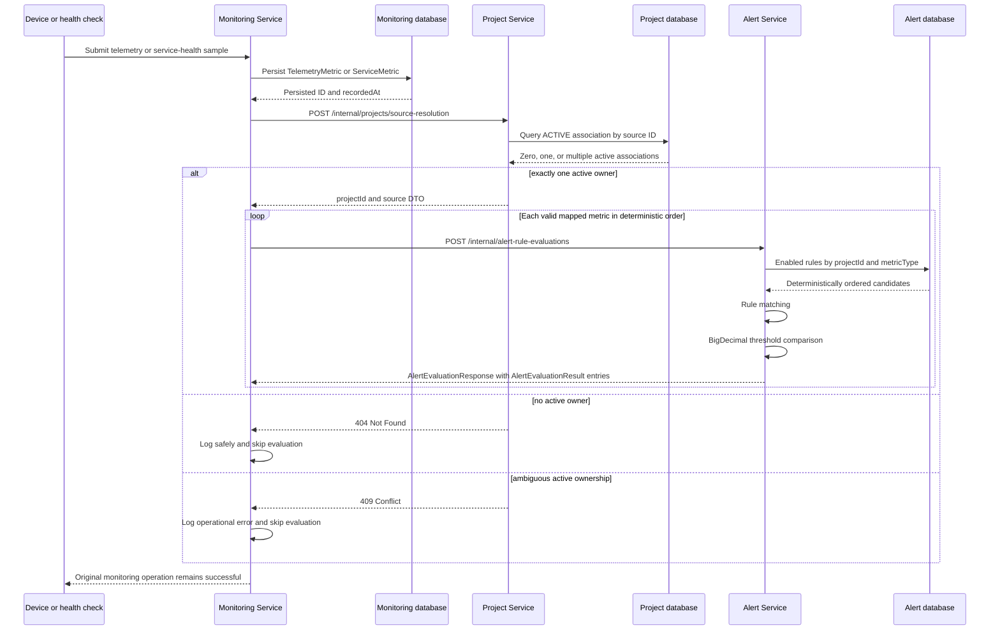

# SCRUM-702 Alert Rule Evaluation Engine Evidence

## 1. Story purpose

SCRUM-702 connects persisted monitoring samples to project-scoped alert-rule evaluation. The implementation resolves the active project owner of a monitored device or service, submits deterministic metric evaluation inputs to the Alert Service, and returns internal evaluation results without creating user-facing alerts.

This evidence reflects the final closure audit performed on 10 August 2026 using Java 21.

## 2. Architecture

The implementation is split across three backend services:

- **Monitoring Service:** persists samples, maps persisted values, derives stable sample identifiers, and isolates downstream failures.
- **Project Service:** resolves the single active project association for a device or service.
- **Alert Service:** retrieves enabled project-and-metric candidates, applies scope matching and threshold comparison, suppresses duplicate samples, and returns deterministic DTO results.

No service reads another service's database. Monitoring does not fetch global project or association lists and does not reproduce rule matching or threshold comparison.

## 3. Full runtime sequence



## 4. Source ownership resolution

### Internal endpoint

`POST /internal/projects/source-resolution`

Request:

```json
{
  "sourceType": "DEVICE",
  "sourceId": "device-1"
}
```

Response:

```json
{
  "projectId": "00000000-0000-0000-0000-000000000000",
  "sourceType": "DEVICE",
  "sourceId": "device-1",
  "associationActive": true,
  "resolvedAt": "2026-08-10T00:00:00Z"
}
```

`DEVICE` queries `ProjectDeviceAssociation` by device ID and `ACTIVE` status. `SERVICE` first validates the source as a UUID, then queries `ProjectServiceAssociation` by service ID and `ACTIVE` status. Zero active associations produce 404; more than one produces 409. The response is a DTO and does not expose persistence entities.

The endpoint requires a valid JWT. Blank fields, unknown enum values, malformed JSON, and malformed service UUIDs are rejected safely. Existing project workspace services are not changed by the resolution flow, and the complete Project Service suite remains green.

## 5. Evaluation input contract

`POST /internal/alert-rule-evaluations`

`AlertEvaluationInput` contains:

- `projectId`
- `sourceType` (`DEVICE` or `SERVICE`)
- `sourceId`
- `metricType`
- `observedValue` as `BigDecimal`
- `observedAt`
- `sampleId`

The endpoint rejects incomplete input and malformed service source identifiers. It requires JWT authentication through the protected `/internal/**` security path.

## 6. Evaluation result contract

`AlertEvaluationResponse` contains:

- evaluation timestamp
- duplicate indicator
- candidate, evaluated, and triggered counts
- ordered `AlertEvaluationResult` entries

Each result identifies the rule, project, source, metric, observed value, threshold, operator, severity, trigger decision, and evaluation timestamp. Triggered and non-triggered rules are both represented. These DTO results are internal and are not persisted as Alert entities.

## 7. Metric mapping

Device telemetry is evaluated after `TelemetryMetric` persistence in this order:

1. `CPU_USAGE` from `cpuUsage`
2. `MEMORY_USAGE` from `memoryUsage`
3. `TEMPERATURE` from `temperature`

Service health is evaluated after `ServiceMetric` persistence in this order:

1. `RESPONSE_TIME_MS` from `responseTimeMs`
2. `STATUS_CODE` from `statusCode`

Monitoring uses the repository-returned record ID and persisted `recordedAt`. Null values are skipped. Device floating-point values are accepted only when finite and are converted with `BigDecimal.valueOf`.

## 8. Comparison operators and precision

`ThresholdComparisonServiceImpl` compares `BigDecimal` values with `compareTo`, avoiding binary floating-point threshold comparison. Supported operators are:

- `GREATER_THAN`
- `GREATER_THAN_OR_EQUAL`
- `LESS_THAN`
- `LESS_THAN_OR_EQUAL`
- `EQUAL`

Tests cover decimal values, equality with different scales, strict operators, and inclusive boundaries.

## 9. Project isolation and scope matching

The candidate repository query filters by `projectId`, `enabled = true`, and `metricType`, ordered by `updatedAt DESC, id ASC`. Matching then defensively rechecks project and metric identity.

- A rule with neither `deviceId` nor `serviceId` is project-wide.
- A device-scoped rule matches only the exact device source ID.
- A service-scoped rule matches only the exact parsed service UUID.
- A rule containing both device and service scope is invalid and is skipped.
- Invalid candidates do not prevent subsequent valid rules from being evaluated.

There is no global rule scan in the evaluation path.

## 10. Duplicate-processing design

Monitoring derives stable identifiers from persisted records:

- Device: `telemetry:{telemetryMetricId}:{metricType}`
- Service: `service-metric:{serviceMetricId}:{metricType}`

The Alert Service duplicate key combines project, source type, source ID, metric type, and sample ID. `EvaluationDuplicateGuard` is an in-memory, synchronized, size-bounded map with a configurable TTL. Duplicate submissions within the same process and TTL return `duplicate = true` without querying or evaluating rules.

This is process-local protection. Distributed idempotency is explicitly outside SCRUM-702.

## 11. Failure isolation

- Monitoring persistence happens before any ownership or evaluation call.
- A Project Service 404 or 409 skips all evaluations for that persisted sample.
- Project Service unavailability is logged and does not reverse successful monitoring persistence.
- Alert Service failure is caught per metric.
- One failed evaluation does not prevent remaining valid metrics.
- Null or non-finite device values skip only the affected metric.
- Monitoring persistence exceptions themselves are not swallowed.

Logs include source identifiers, metric types, counts, and durations. Bearer tokens, JWT contents, and secrets are not logged.

## 12. Security and internal endpoints

Both internal endpoints require JWT authentication:

- Project Service: `POST /internal/projects/source-resolution`
- Alert Service: `POST /internal/alert-rule-evaluations`

Monitoring propagates the authenticated caller credential using the existing `EdgeCloudJwtAuthenticationToken` convention. Telemetry ingestion remains compatible without a token; when a Bearer token is supplied, the existing filter authenticates it for downstream propagation. Downstream service URLs are environment-overridable and retain local development defaults.

## 13. Performance design and evidence

The Alert Service repository performs a selective candidate query on `projectId`, enabled state, and metric type. Candidate processing is therefore bounded by the matching enabled rules for one project and metric, not by all rules in the database. The query has deterministic ordering, and evaluation preserves that order.

The controlled acceptance target is: **500 applicable candidate rules must be evaluated in under 1,000 ms** by the isolated evaluation engine.

The controlled test includes duplicate-guard interaction, evaluation-service orchestration, rule validation, scope matching, threshold comparison, and result construction. It excludes HTTP and network calls, Project Service ownership resolution, Monitoring Service persistence, and database-query latency because the repository is mocked. The candidate set contains 500 enabled, matching project-wide and device-scoped rules distributed across all supported comparison operators.

`AlertRuleEvaluationServiceImplTest` performs one unmeasured warm-up followed by five measured evaluations with unique sample IDs. Every measured response must contain 500 candidates, 500 evaluated results, and 500 triggered results. Each iteration independently asserts elapsed time below 1,000 ms.

The focused Java 21 run reported:

- individual durations: `93 ms`, `72 ms`, `68 ms`, `63 ms`, `53 ms`
- minimum: `53 ms`
- maximum: `93 ms`
- average: `69.80 ms`
- median: `68 ms`

The same controlled test ran again during required validation. The clean test invocation recorded `148–176 ms` with a `159.80 ms` average and `160 ms` median; the clean package invocation recorded `136–247 ms` with a `168.80 ms` average and `154 ms` median. Every measured iteration passed the target.

These are controlled local-development measurements, not a production benchmark, throughput claim, or service-level agreement. Evaluation completion logs continue to record `durationMs` for operational observation.

## 14. Acceptance criteria audit

| Acceptance criterion | Status | Verified evidence |
|---|---|---|
| AC1 Enabled Rules Evaluated | MET | Repository query requires `enabled = true`; candidates are evaluated. |
| AC2 Disabled Rules Ignored | MET | Disabled rules are excluded by the repository query. |
| AC3 Metric Type Matching | MET | Query and defensive matcher require the input metric type. |
| AC4 Project Scope Enforcement | MET | Query and matcher require the exact project ID. |
| AC5 Service Scope Enforcement | MET | Exact service UUID matching is tested. |
| AC6 Device Scope Enforcement | MET | Exact device ID and project-wide matching are tested. |
| AC7 Greater Than Evaluation | MET | `GREATER_THAN` uses `BigDecimal.compareTo` and is tested. |
| AC8 Less Than Evaluation | MET | `LESS_THAN` uses `BigDecimal.compareTo` and is tested. |
| AC9 Inclusive Operator Evaluation | MET | Both inclusive operators and equality are tested. |
| AC10 Non-Triggered Result | MET | A valid non-triggered result remains in the response. |
| AC11 Invalid Rule Handling | MET | Invalid rules are skipped while later valid rules continue. |
| AC12 Evaluation Result | MET | DTO response counts and ordered result fields are implemented and tested. |
| AC13 Duplicate Processing Protection | MET | Stable sample IDs and process-local duplicate suppression are tested. |
| AC14 Evaluation Performance | MET | One warm-up and five measured 500-rule evaluations independently passed the controlled `< 1,000 ms` target with correctness counts preserved. |

## 15. Final automated validation

All commands used Java 21.

| Repository | Clean test | Clean package | Diff check |
|---|---:|---:|---:|
| Project Service | 214 tests passed | 214 tests passed; JAR produced | Passed |
| Alert Service | 44 tests passed | 44 tests passed; JAR produced | Passed |
| Monitoring Service | 68 tests passed | 68 tests passed; JAR produced | Passed |
| Documentation | Not applicable | Not applicable | Passed |

## 16. Manual evidence

- Authenticated Project Service request/response capture: **PENDING MANUAL CAPTURE**
- Project Service 404 and 409 response captures: **PENDING MANUAL CAPTURE**
- Authenticated Alert Service evaluation response capture: **PENDING MANUAL CAPTURE**
- Runtime evaluation-duration log capture: **PENDING MANUAL CAPTURE**
- End-to-end telemetry ingestion trace: **PENDING MANUAL CAPTURE**

No screenshot or manual log capture is claimed as complete.

## 17. Out-of-scope boundaries

SCRUM-702 does not implement:

- persisted user-facing alert events
- notifications
- incidents
- acknowledgement
- escalation
- suppression windows
- distributed idempotency
- AI anomaly detection
- automatic remediation

Gateway and Dashboard changes are not part of this story.
