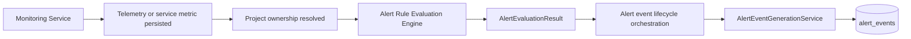

# SCRUM-703 Alert Event Generation and Lifecycle Evidence

## 1. Story purpose and scope

SCRUM-703 turns project-scoped alert-rule evaluation results into durable, read-only alert-event history. It adds OPEN/RESOLVED lifecycle persistence, concurrency-safe duplicate prevention, project-scoped read APIs, API Gateway routing, and a responsive project dashboard.

This closure evidence was audited on 10 August 2026. Legacy V1 `Alert` behavior and the global dashboard `/alerts` page remain separate and unchanged. SCRUM-703 does not add acknowledgement, manual resolution, notification delivery, assignment, escalation, suppression, incidents, or remediation.

## 2. Runtime architecture



The Monitoring and Project Service integration was delivered by SCRUM-702 and was not changed by SCRUM-703. Alert Service orchestration processes each returned `AlertEvaluationResult` through the lifecycle service while preserving the existing internal evaluation response contract.

Lifecycle rules:

- Triggered with no matching OPEN event: create an OPEN event.
- Triggered with an existing matching OPEN event: update its evidence and `lastObservedAt`.
- Non-triggered with a matching OPEN event: transition it to RESOLVED and populate `resolvedAt`.
- Non-triggered with no matching OPEN event: persist nothing.
- Triggered after resolution: create a new OPEN event with a different alert ID, preserving resolved history.

## 3. AlertEvent data model

The `alert_events` record contains:

- alert ID
- alert-rule ID
- rule-name snapshot
- project ID
- source type (`DEVICE` or `SERVICE`)
- source ID
- metric type
- observed value
- threshold value
- comparison operator
- severity (`LOW`, `MEDIUM`, or `HIGH`)
- status (`OPEN` or `RESOLVED`)
- `triggeredAt`
- `lastObservedAt`
- nullable `resolvedAt`
- `createdAt`
- `updatedAt`

Rule name, threshold, operator, and severity are persisted as event evidence so historical meaning does not depend on later rule edits. The new model does not replace or modify the legacy V1 `Alert` entity.

## 4. Duplicate prevention and MySQL concurrency design

Flyway migration `V3__create_alert_events_table.sql` defines:

```text
open_marker = 1    when status = OPEN
open_marker = NULL when status = RESOLVED
```

The unique active identity is:

```text
projectId + alertRuleId + sourceType + sourceId + metricType + openMarker
```

Alert creation/update uses an atomic MySQL `INSERT ... ON DUPLICATE KEY UPDATE` operation. Because MySQL permits multiple NULL values in a unique key, multiple RESOLVED historical rows may coexist for the same logical identity, while only one OPEN row may exist.

`AlertEventMySqlIntegrationTest` uses Testcontainers 1.21.4 with the `mysql:8.4` image; the runtime reported MySQL 8.4.11. Flyway V2 and V3 initialise the container schema. Twenty latch-synchronised threads call the real `AlertEventGenerationService.process(...)` triggered path with the same identity. All 20 calls complete, return the same OPEN alert identity, and leave exactly one valid OPEN database row. The same suite verifies repeated update, resolution, re-trigger, and multiple RESOLVED rows. H2 was not used as a substitute for this final MySQL proof.

## 5. Public V2 read API

Endpoints:

- `GET /api/v2/projects/{projectId}/alerts`
- `GET /api/v2/projects/{projectId}/alerts/{alertId}`

List query parameters:

- `status`
- `severity`
- `sourceType`
- `sourceId`
- `from`
- `to`
- `page`
- `size`
- `sortDirection`

Defaults and limits:

- page: `0`
- size: `20`
- maximum size: `100`
- primary order: `triggeredAt DESC`
- deterministic fallback: `id ASC`

The list uses database-side specifications and pagination. Detail lookup requires both `alertId` and `projectId`. Responses are DTOs. No lifecycle mutation endpoint is part of SCRUM-703.

## 6. Security and project isolation

- A JWT is required at Gateway and Alert Service for `/api/v2/**`.
- `ADMIN`, `PROJECT_ADMIN`, `OPERATOR`, and `VIEWER` have read access after project authorization succeeds.
- Alert Service calls the existing project workspace authorization contract before executing list or detail queries.
- Inaccessible and archived projects return 403 before alert-query execution under current workspace semantics.
- Every list specification includes the selected project ID.
- Detail retrieval uses `findByIdAndProjectId`; a foreign-project alert returns 404 and is not disclosed.
- Responses expose DTOs rather than persistence entities.
- Bearer tokens and JWT contents are not logged.
- Historical event source membership is intentionally not revalidated after later source disassociation; the event remains project-owned historical evidence.
- Alert Service remains authoritative for alert-event authorization, validation, and persistence.

## 7. Gateway and dashboard

The API Gateway routes `/api/v2/projects/*/alerts/**` to `lb://EDGECLOUD-ALERT-SERVICE` without `StripPrefix`, preserving the full controller path. The existing V2 alert-rule route and V1 alert route remain intact. The Gateway JWT filter protects `/api/v2/` and forwards the unchanged Bearer header.

Dashboard route: `/projects/:projectId/alerts`.

The existing global `/alerts` route remains unchanged. The project view includes:

- project-context Alerts navigation
- OPEN and RESOLVED badges with non-colour text/symbol cues
- LOW, MEDIUM, and HIGH severity presentation
- rule, source, metric, observed, threshold, and lifecycle evidence
- server-side status, severity, source-type, source-ID, and date filters
- backend pagination with page sizes up to 100
- complete read-only detail drawer
- desktop table and responsive tablet/mobile cards
- workspace, list, and detail loading states
- empty and filtered-empty states
- API, unauthorized, inaccessible, and archived-project states

There are no Resolve, Acknowledge, or other lifecycle mutation controls.

## 8. Controlled performance evidence

Acceptance target: **each bounded lifecycle operation or query must complete in under 1,000 ms**.

The test performs one warm-up and five measured runs with a correctness assertion on every run. The query returns a filtered project page of 50 records. These are controlled local-development measurements, not a production benchmark, throughput statement, or service-level agreement.

| Operation | Individual durations (ms) | Minimum | Maximum | Average | Median |
|---|---|---:|---:|---:|---:|
| New OPEN | 8.136, 8.610, 5.961, 7.457, 6.078 | 5.961 | 8.610 | 7.248 | 7.457 |
| Existing OPEN update | 5.930, 7.008, 5.535, 5.689, 7.531 | 5.535 | 7.531 | 6.339 | 5.930 |
| Resolution | 13.205, 13.435, 39.985, 43.597, 15.981 | 13.205 | 43.597 | 25.241 | 15.981 |
| Filtered 50-record project page | 8.968, 8.482, 9.607, 8.086, 8.435 | 8.086 | 9.607 | 8.716 | 8.482 |

Every recorded iteration passed. The final closure clean-test and clean-package reruns also passed the same target.

## 9. Acceptance criteria audit

| Criterion | Status | Concrete evidence |
|---|---|---|
| AC1 Triggered Evaluation Creates Alert | MET | Generation-service and MySQL tests create one OPEN event through the production path. |
| AC2 Alert Evidence Persisted | MET | Entity/migration and tests verify rule snapshot, project/source/metric values, observed value, threshold, operator, severity, and lifecycle timestamps. |
| AC3 Non-Triggered Evaluation Creates No Alert | MET | `nonTriggeredWithoutOpenEventIsNoOp` verifies no persistence without an OPEN match. |
| AC4 Active Duplicate Prevention | MET | MySQL generated-column uniqueness, atomic upsert, repository constraint test, and 20-thread real-MySQL test. |
| AC5 Last Observed Time Updated | MET | Repeated-trigger unit and MySQL lifecycle tests retain the alert ID and update `lastObservedAt`. |
| AC6 Alert Resolution | MET | Recovery test verifies OPEN to RESOLVED and populated resolution timestamps. |
| AC7 Re-Trigger After Resolution | MET | Unit and MySQL tests verify a new OPEN ID and unchanged RESOLVED history. |
| AC8 Project Isolation | MET | Project predicate, project-scoped detail lookup, controller authorization-before-query, and cross-project 404 tests. |
| AC9 Resource Scope | MET | Complete identity includes source type/source ID; device and service mapping and filtered source queries are tested. |
| AC10 Status Filtering | MET | Repository specification and controller forwarding tests cover OPEN/RESOLVED filtering. |
| AC11 Severity Filtering | MET | Repository specification and controller forwarding tests cover severity filtering. |
| AC12 Chronological Ordering | MET | Query service applies `triggeredAt` direction with `id ASC`; deterministic pagination test passes. |
| AC13 Alert Detail Retrieval | MET | Project-scoped detail service/controller and dashboard drawer tests cover complete DTO retrieval. |
| AC14 Invalid Evaluation Protection | MET | Generation validation rejects incomplete/malformed results before persistence; invalid evaluation candidates remain isolated. |
| AC15 Transactional Consistency | MET | Lifecycle processing is transactional; resolution uses a pessimistic OPEN-row lock and triggered writes use atomic MySQL upsert. Lifecycle and concurrency tests pass without partial/corrupt state. |

## 10. Final automated validation

Java validation used Java 21.

| Repository | Validation | Result |
|---|---|---|
| Alert Service | `./mvnw clean test` | 73 tests passed; MySQL Testcontainers suite included |
| Alert Service | `./mvnw clean package` | 73 tests passed; JAR produced |
| API Gateway | `./mvnw clean test` | 4 tests passed |
| API Gateway | `./mvnw clean package` | 4 tests passed; JAR produced |
| Dashboard | `CI=true npm test` | 137 tests passed across 23 files |
| Dashboard | `npm run build` | Production build passed |
| All changed repositories | `git diff --check` | Passed |

The dashboard build reports an existing advisory for a main JavaScript chunk over 500 kB; it does not fail the build. Flyway reports that MySQL 8.4 is newer than its latest verified MySQL 8.1, but V2/V3 migration and all MySQL tests pass.

Monitoring Service and Project Service worktrees are clean on `main`; SCRUM-703 did not change either repository.

## 11. Evidence checklist

- Backend unit tests: **COMPLETED**
- Repository tests: **COMPLETED**
- MySQL integration tests: **COMPLETED**
- 20-way concurrency evidence: **COMPLETED**
- Lifecycle/re-trigger evidence: **COMPLETED**
- Project-isolation evidence: **COMPLETED**
- Controlled performance evidence: **COMPLETED**
- Gateway routing and JWT tests: **COMPLETED**
- Frontend tests: **COMPLETED**
- Production builds: **COMPLETED**
- OPEN alert screenshot: **PENDING MANUAL CAPTURE**
- RESOLVED alert screenshot: **PENDING MANUAL CAPTURE**
- Alert detail screenshot: **PENDING MANUAL CAPTURE**
- Status/severity filter screenshot: **PENDING MANUAL CAPTURE**
- Mobile/tablet alert view: **PENDING MANUAL CAPTURE**
- Runtime trigger-to-resolve recording/log capture: **PENDING MANUAL CAPTURE**

No screenshot, recording, or manual runtime log capture is claimed as complete.

## 12. Out-of-scope confirmation

SCRUM-703 did not implement:

- acknowledgement
- assignment
- notifications
- email
- SMS
- webhook delivery
- escalation
- suppression
- maintenance windows
- incidents
- root cause analysis
- remediation
- comments
- AI explanations

